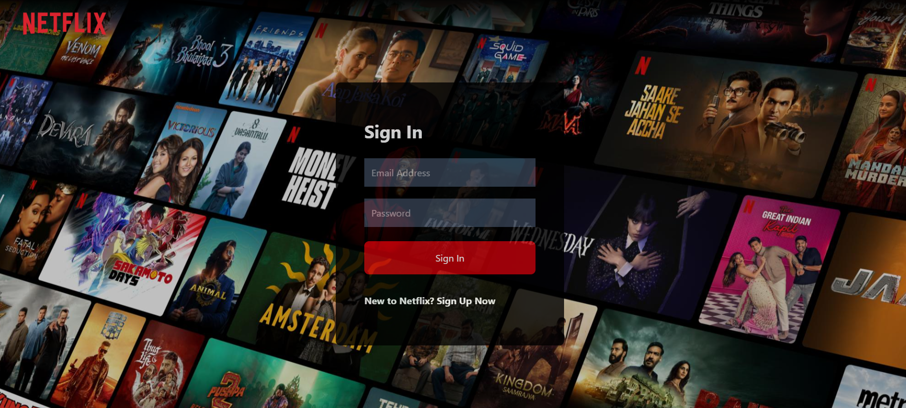
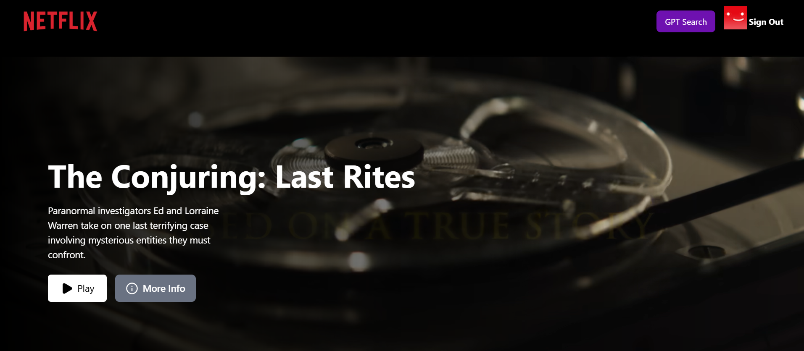
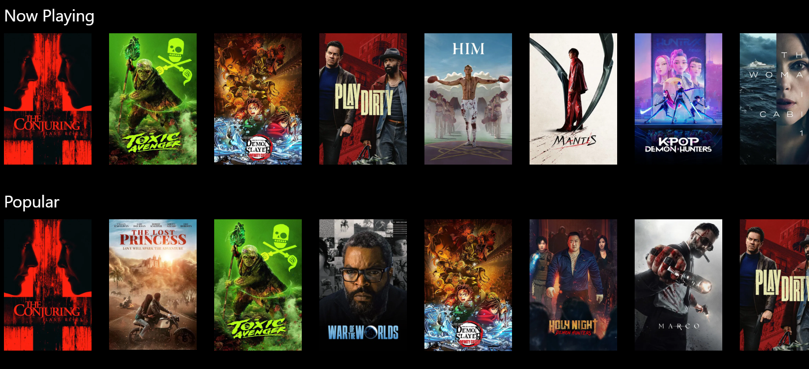
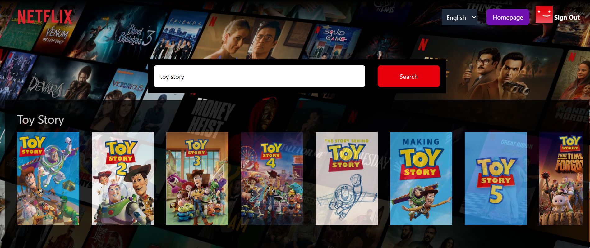

# 🎬 Netflix GPT

<div align="center">
  
  
  
  **A Netflix-inspired streaming platform with AI-powered movie recommendations**
  
  [🌐 Live Demo](netflix-gpt-wohu.vercel.app)  [🐛 Report Bug](https://github.com/ayush14019/netflix-gpt/issues)

  
  
  
  
  
  
  
  
  
  
  

</div>

---

## 📋 Table of Contents

- [About The Project](#-about-the-project)
- [Features](#-features)
- [Tech Stack](#-tech-stack)
- [Getting Started](#-getting-started)
- [Project Structure](#-project-structure)
- [Development Journey](#-development-journey)
- [Screenshots](#-screenshots)
- [Contributing](#-contributing)
- [License](#-license)

---

## 🎯 About The Project

Netflix GPT is a modern, full-stack streaming platform that combines the familiar Netflix UI with powerful AI capabilities. Built with React and powered by Groq AI, it offers intelligent movie recommendations and a seamless browsing experience.

### ✨ Key Highlights

- 🔐 Secure authentication with Firebase
- 🤖 AI-powered movie search using Groq AI
- 🎥 Real-time movie data from TMDB API
- 📱 Fully responsive design
- 🌍 Multi-language support
- ⚡ Optimized performance with memoization

---

## 🚀 Features

### 🔑 Authentication System
- **Smart Login/Sign Up** - Seamless user authentication flow
- **Form Validation** - Real-time validation with useRef Hook
- **Profile Management** - Update display name and profile picture
- **Auto Navigation** - Intelligent redirect based on auth state
- **Secure Sign Out** - Clean session management

### 🎬 Browse Experience
- **Dynamic Header** - Navigation and user controls
- **Hero Section**
  - Full-screen trailer background (autoplay & muted)
  - Movie title and description overlay
- **Curated Collections**
  - 🔥 Now Playing
  - ⭐ Popular
  - 🏆 Top Rated
  - 🎉 Upcoming
  - 👻 Horror
- **Smooth Scrolling** - Horizontal movie card carousels
- **High-Quality Images** - TMDB CDN integration

### 🤖 Netflix GPT Search
- **AI Search Bar** - Natural language movie queries
- **Smart Suggestions** - Groq AI-powered recommendations
- **Multi-Language** - Search in your preferred language
- **Instant Results** - Fast API responses with optimized queries

---

## 🛠️ Tech Stack

### Frontend


### State Management


### Backend & APIs


### Tools & Deployment


---

## 🏁 Getting Started

### Prerequisites

```bash
node >= 16.0.0
npm >= 8.0.0
```

### Installation

1. **Clone the repository**
```bash
git clone https://github.com/yourusername/netflix-gpt.git
cd netflix-gpt
```

2. **Install dependencies**
```bash
npm install
```

3. **Set up environment variables**

Create a `.env` file in the root directory:

```env
# Firebase Configuration
VITE_FIREBASE_API_KEY=your_firebase_api_key
VITE_FIREBASE_AUTH_DOMAIN=your_auth_domain
VITE_FIREBASE_PROJECT_ID=your_project_id
VITE_FIREBASE_STORAGE_BUCKET=your_storage_bucket
VITE_FIREBASE_MESSAGING_SENDER_ID=your_sender_id
VITE_FIREBASE_APP_ID=your_app_id

# TMDB API
VITE_TMDB_API_KEY=your_tmdb_api_key

# Groq AI
VITE_GROQ_API_KEY=your_groq_api_key
```

4. **Run the development server**
```bash
npm run dev
```

5. **Open your browser**
```
http://localhost:5173
```

### Build for Production

```bash
npm run build
```

---

## 📁 Project Structure

```
netflix-gpt/
├── src/
│   ├── components/
│   │   ├── Header.jsx
│   │   ├── Login.jsx
│   │   ├── Browse.jsx
│   │   ├── MainContainer.jsx
│   │   ├── SecondaryContainer.jsx
│   │   ├── VideoBackground.jsx
│   │   ├── VideoTitle.jsx
│   │   ├── MovieList.jsx
│   │   ├── MovieCard.jsx
│   │   └── GptSearch.jsx
│   ├── hooks/
│   │   ├── useNowPlayingMovies.js
│   │   ├── usePopularMovies.js
│   │   ├── useTopRatedMovies.js
│   │   ├── useUpcomingMovies.js
│   │   └── useHorrorMovies.js
│   ├── store/
│   │   ├── store.js
│   │   ├── userSlice.js
│   │   ├── movieSlice.js
│   │   └── gptSlice.js
│   ├── utils/
│   │   ├── constants.js
│   │   ├── firebase.js
│   │   └── validate.js
│   └── App.jsx
├── .env
├── .gitignore
├── package.json
└── README.md
```

### Component Hierarchy

```
MainContainer
├── VideoBackground
├── VideoTitle
└── SecondaryContainer
    └── MovieList × n
        └── MovieCard × n

Movie Lists:
├── Now Playing
├── Popular
├── Top Rated
├── Upcoming
└── Horror
```

---

## 🛤️ Development Journey

### Phase 1: Setup & Configuration ⚙️
- [x] Created project with Vite
- [x] Configured TailwindCSS
- [x] Set up routing for the app
- [x] Firebase setup and integration
- [x] Deployed app to production
- [x] Added .env file for environment variables
- [x] Added .env to .gitignore

### Phase 2: Authentication Implementation 🔐
- [x] Built Header component
- [x] Created Login Form
- [x] Created Sign Up Form
- [x] Implemented form validation
- [x] Used useRef Hook for form handling
- [x] Created Sign Up user accounts
- [x] Implemented Sign In with Firebase API
- [x] Implemented Sign Out feature
- [x] Update Profile (displayName and Profile picture)
- [x] **BugFix**: Sign Up user displayName and Profile picture update
- [x] **BugFix**: Redirect logic - if user not logged in redirect /browse to /login and vice versa
- [x] Unsubscribed from onAuthStateChanged callback

### Phase 3: State Management 🔄
- [x] Created Redux Store with userSlice
- [x] Created movieSlice for movie data
- [x] Created gptSlice for GPT search data
- [x] Updated store with movie data
- [x] Updated store with trailer video data
- [x] Refactored movie hooks and state management

### Phase 4: TMDB Integration 🎬
- [x] Registered TMDB API & created app
- [x] Got TMDB access token
- [x] Added hardcoded values to constants file
- [x] Fetched Now Playing movies from TMDB API
- [x] Created custom hook: `useNowPlayingMovies`
- [x] Created custom hook: `usePopularMovies`
- [x] Created custom hook: `useTopRatedMovies`
- [x] Created custom hook: `useUpcomingMovies`
- [x] Created custom hook: `useHorrorMovies`
- [x] Implemented TMDB Image CDN URL

### Phase 5: UI Components 🎨
- [x] Planned Main Container & Secondary Container structure
- [x] Fetched trailer video data
- [x] Embedded YouTube video with autoplay and mute
- [x] Applied Tailwind classes to Main Container
- [x] Built Secondary Component
- [x] Built Movie List component
- [x] Built Movie Card component
- [x] Enhanced Browse page with Tailwind CSS
- [x] Made site responsive

### Phase 6: GPT Search Feature 🤖
- [x] Created GPT Search Page
- [x] Built GPT Search Bar
- [x] Got Groq AI API key
- [x] Implemented Groq search API call
- [x] Fetched GPT movie suggestions from TMDB
- [x] Reused Movie List component for suggestions
- [x] **BONUS**: Multi-Language Feature

### Phase 7: Optimization ⚡
- [x] Implemented Memoization for performance
- [x] Optimized API calls
- [x] Added loading states
- [x] Improved error handling

---

## 📸 Screenshots

> Add screenshots of your application here

### Home Page


### Browse Page


### Movie Cards


### GPT Search


---

## 🎓 What I Learned

- Building scalable React applications with Vite
- Implementing secure authentication flows with Firebase
- Managing complex state with Redux Toolkit
- Creating custom hooks for code reusability
- Integrating third-party APIs (TMDB, Groq AI)
- Responsive design with Tailwind CSS
- Performance optimization techniques
- Best practices for environment variables

---


## 🤝 Contributing

Contributions are what make the open-source community such an amazing place to learn, inspire, and create. Any contributions you make are **greatly appreciated**.

1. Fork the Project
2. Create your Feature Branch (`git checkout -b feature/AmazingFeature`)
3. Commit your Changes (`git commit -m 'Add some AmazingFeature'`)
4. Push to the Branch (`git push origin feature/AmazingFeature`)
5. Open a Pull Request

---


## 👨‍💻 Author

** Ayush **

- GitHub: [Ayush Raj](https://github.com/ayush14019)
- LinkedIn: [Ayush Raj](www.linkedin.com/in/ayush-raj-8bb362213)
- Email: rajayush224@gmail.com

---

## 🙏 Acknowledgments

- [TMDB](https://www.themoviedb.org/) for the amazing movie database API
- [Firebase](https://firebase.google.com/) for authentication services
- [Groq](https://groq.com/) for AI capabilities
- [Tailwind CSS](https://tailwindcss.com/) for the utility-first CSS framework
- [Netflix](https://www.netflix.com/) for design inspiration

---

<div align="center">
  
  **⭐ If you found this project helpful, please consider giving it a star!**
  
  Made with ❤️ and ☕
  
</div>